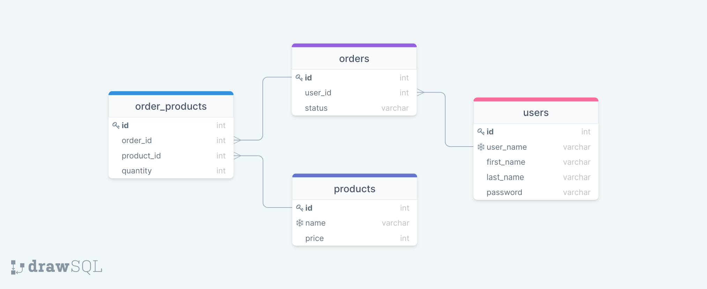

# API Requirements

The company stakeholders want to create an online storefront to showcase their great product ideas. Users need to be able to browse an index of all products, see the specifics of a single product, and add products to an order that they can view in a cart page. You have been tasked with building the API that will support this application, and your coworker is building the frontend.

These are the notes from a meeting with the frontend developer that describe what endpoints the API needs to supply, as well as data shapes the frontend and backend have agreed meet the requirements of the application.

## API Endpoints

#### Products

_Index_

```http
GET localhost:3000/api/products/
```

_Show_

```http
GET localhost:3000/api/products/:id
```

-id Parameter for the product  
| Parameter | Type     |
| :-------- | :------- |
| `id`      | `number` |

_Create [token required]_

```http
POST localhost:3000/api/products/
```

| Header          | Type     | Description                        |
| :-------------- | :------- | :--------------------------------- |
| `Authorization` | `string` | `need token from users\auth route` |

-body json type needed
| body | Type |
| :-------- | :------- |
| `name` | `string` |
| `price` | `number` |

-   [OPTIONAL] Top 5 most popular products
-   [OPTIONAL] Products by category (args: product category)

#### Users

_Index [token required]_

```http
GET localhost:3000/api/users/
```

| Header          | Type     | Description                        |
| :-------------- | :------- | :--------------------------------- |
| `Authorization` | `string` | `need token from users\auth route` |

_Show [token required]_

```http
GET localhost:3000/api/users/:id
```

| Header          | Type     | Description                        |
| :-------------- | :------- | :--------------------------------- |
| `Authorization` | `string` | `need token from users\auth route` |

-id Parameter for the user  
| Parameter | Type |
| :-------- | :------- |
| `id` | `number` |

_Create_

```http
POST localhost:3000/api/users/
```

-body json type needed
| body        | Type     | Description |
| :--------   | :------- | :-------------------------------- |
| `user_name` | `string` | `unique user name for each user`  |
| `first_name`| `string` | `first name for the user`         |
| `last_name` | `string` | `last name for the user`          |
| `password`  | `string` | `password name for the user`      |

_Auth_

```http
POST localhost:3000/api/users/auth
```

`This field simulates how to login to generate token to use in the rest of the app`
-body json type needed
| body        | Type     | Description                       |
| :--------   | :------- | :-------------------------------- |
| `user_name` | `string` | `unique user name for each user`  |
| `password`  | `string` | `password name for the user`      |

#### Orders

_Current Order by user (args: user id)[token required]_

_-Create Order using user id [token required]_

```http
POST localhost:3000/api/orders/create/:id
```

| Header          | Type     | Description                        |
| :-------------- | :------- | :--------------------------------- |
| `Authorization` | `string` | `need token from users\auth route` |

-id Parameter for the user
| Parameter | Type     |
| :-------- | :------- |
| `id`      | `number` |

-body json type needed
| body | Type | Description                                |
| :-------- | :------- | :-------------------------------- |
| `status`  | `string` | `status of the order`             |

_-Add product to the order created using order id and product id [token required]_

```http
POST localhost:3000/api/orders/add-product/:id
```

| Header          | Type     | Description                        |
| :-------------- | :------- | :--------------------------------- |
| `Authorization` | `string` | `need token from users\auth route` |

-id Parameter for the order you want to add in
| Parameter | Type     |
| :-------- | :------- |
| `id`      | `number` |

-body json type needed
| body         | Type     | Description                       |
| :--------    | :------- | :-------------------------------- |
| `product_id` | `number` | `id of the product`               |
| `quantity`   | `number` | `quantity of the product`         |

_Get all the product in the order using order id [token required]_

```http
GET localhost:3000/api/orders/check-products/:id
```

| Header          | Type     | Description                        |
| :-------------- | :------- | :--------------------------------- |
| `Authorization` | `string` | `need token from users\auth route` |

-id Parameter for the order you want to check in
| Parameter | Type     |
| :-------- | :------- |
| `id`      | `number` |

_Get all the orders done by user using user id [token required]_

```http
GET localhost:3000/api/orders/check-orders/:id
```

| Header          | Type     | Description                        |
| :-------------- | :------- | :--------------------------------- |
| `Authorization` | `string` | `need token from users\auth route` |

-id Parameter for the user you want to check the order he/she made
| Parameter | Type     |
| :-------- | :------- |
| `id`      | `number` |

-   [OPTIONAL] Completed Orders by user (args: user id)[token required]

## Data Shapes

#### Product

-   id `NUMBER`
-   name `STRING`
-   price `NUMBER`
-   [OPTIONAL] category

#### User

-   id `NUMBER`
-   firstName `STRING`
-   lastName `STRING`
-   password `STRING`

#### Orders

-   id `NUMBER`
-   id of each product in the order `NUMBER`
-   quantity of each product in the order `NUMBER`
-   user_id `NUMBER`
-   status of order (active or complete)

## Database schema
